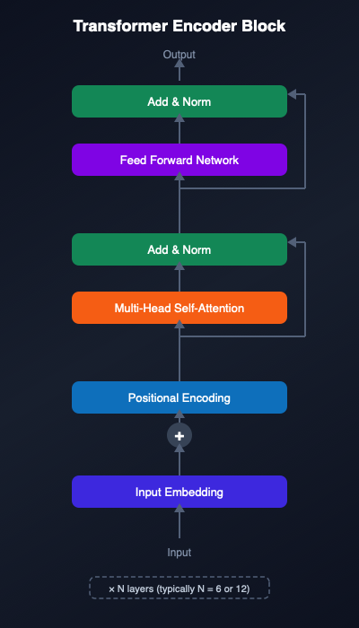
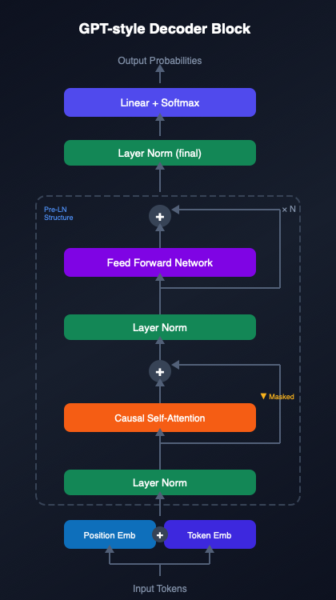

# AhoTransformer

- Shuichi Kurabayashi <shuichi.kurabayashi@keio.jp>
- 2025.12.2

## 概要

「3 の倍数 または 3 を含む数」を “アホ” と判定するだけのミニタスクを、Transformer で解かせるサンプル集です。  
エンコーダ専用（BERT 風）とデコーダ専用（GPT 風）の 2 実装を用意し、どちらも丁寧な日本語コメント入りで書いています。




## リポジトリ構成

- `encoderonly.py`: エンコーダのみの Transformer で二値分類（BCEWithLogitsLoss）。
- `decoderonly.py`: デコーダのみの Transformer で最後のラベルトークンを予測（CrossEntropyLoss）。
- `models/encoder_epoch_30.pth`, `models/decoder_epoch_40.pth`: 手元で学習したチェックポイント例。
- `images/`: 図版（エンコーダ/デコーダブロック、TensorBoard 例）。
- `pyproject.toml`: 依存関係宣言（PyTorch, TensorBoard など）。

## 事前準備

1. Python 3.10 以上（pyproject は 3.14 以上を要求）。
2. PyTorch を GPU/MPS 環境に合わせてインストール（[公式](https://pytorch.org/get-started/locally/)のコマンドを利用）。
3. その他依存を追加でインストール:
   ```bash
   uv venv
   uv pip install torch --torch-backend=auto
   uv sync
   ```
   Python から CUDA が利用可能かどうかは、`uv run python -c "import torch; print(torch.cuda.is_available())"` でチェックできます。

## 使い方（クイックスタート）

### エンコーダ版（`encoderonly.py`）

- 学習（1〜4 万を訓練、4 万 1〜5 万を検証。10 epoch ごと保存）:
  ```bash
  uv run encoderonly.py
  ```
- 既存チェックポイントで推論だけ実行（1,000 個をランダム判定）:
  ```bash
  uv run encoderonly.py -c models/encoder_epoch_30.pth
  ```
- 対話モード（数字を入力すると即判定）:
  ```bash
  uv run encoderonly.py -c models/encoder_epoch_30.pth -i
  ```

### デコーダ版（`decoderonly.py`）

- 学習（1〜4 万を訓練、4 万 1〜5 万を検証。10 epoch ごとに保存）:
  ```bash
  uv run decoderonly.py
  ```
- 既存チェックポイントで推論だけ実行:
  ```bash
  uv run decoderonly.py -c models/decoder_epoch_40.pth
  ```
- 対話モード:
  ```bash
  uv run decoderonly.py -c models/decoder_epoch_40.pth -i
  ```

## 実装のポイント

- ルールは `is_aho_number` に統一: 「3 の倍数」または「桁に 3 を含む」なら True。
- トークナイザ:
  - エンコーダ版: `[CLS] + 桁列 + [PAD]` の固定長化。
  - デコーダ版: `桁列 + [SEP] + [MASK] + [PAD]`、最後の位置で `[AHO]/[SAFE]` を分類。
- 位置エンコーディング:
  - エンコーダ版は `PositionalEncoding`（batch_first=False）。
  - デコーダ版は `PositionalEncoding`（batch_first=True）と因果マスクで GPT 風。
- 学習データはすべて合成（整数範囲をスクリプト内で決定）。外部データ不要。
- TensorBoard ログ（エンコーダ版）は `runs/` に出力。`uvx tensorboard --logdir runs` で確認可能。

## よくある調整ポイント

- GPU/MPS が無い場合は自動で CPU 実行。`d_model` や `num_layers` を小さくすると軽くなります。
- デコーダ版の学習はデフォルトで 1000 epoch と長いので、`num_epochs` を減らして試すのがおすすめです。
- チェックポイントの出力先は両スクリプトとも `checkpoints/`（存在しなければ自動作成）。

## ライセンス

GPL3 License。詳細は `LICENSE` を参照してください。
